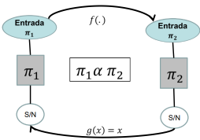
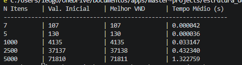

# Projeto Final: Abordagem baseada em VND para o Problema da Mochila 0-1

&nbsp;&nbsp;&nbsp;&nbsp;&nbsp; Entre os diversos problemas que poderiam ser escolhidos, optamos pelo Problema da Mochila 0-1 porque já trabalhamos em uma atividade anterior. O assunto da Unidade 2 dessa disciplina abordava programação dinâmica. Assim, iniciamos a definição dessa atividade a seguir e, por fim, discutiremos os resultados e as possíveis comparações.

Por Leandro Gomes do Nascimento

Acessível em https://github.com/leoPirpiri/master-projects/new/main/estrutura_de_dados_e_complexidade_de_algoritmos

## Problema de Otimização Combinatória

&nbsp;&nbsp;&nbsp;&nbsp;&nbsp; O problema da mochila é um problema clássico de otimização combinatória. Ele consiste em uma mochila com capacidade de peso limitada e um conjunto de itens que possuem peso e valor. A finalidade é escolher um arranjo de itens que maximize o valor total sem ultrapassar essa capacidade.

Formalmente, temos um conjunto de **n** itens com seus respectivos valores ($v_i$) e pesos ($w_i$), a capacidade da mochila e variáveis de decisão ($x_i \in \{0, 1\}$).

$$\max \sum_{i=1}^{n} v_i x_i$$
Isso implica dizer que a função percorrerá todos os itens do conjunto **n**, somando todos os valores $v_i$ caso o item seja escolhido, sinalizado por $x_i = 1$.

$$\sum_{i=1}^{n} w_i x_i \leq C$$
A soma dos pesos dos itens escolhidos também não pode exceder a capacidade máxima da mochila.

### NP-Completude

&nbsp;&nbsp;&nbsp;&nbsp;&nbsp; Para sabermos se o problema da mochila pertence à classe NP, precisamos verificar se existe um algoritmo não determinístico que decida em tempo polinomial para uma possível solução. Por exemplo:

Dado um conjunto de $x_i = [0, 1, 0, 1, 1]$, verificamos esses elementos um a um, calculando o peso total em $(0 + w_2 + 0 + w_4 + w_5)$ menor do que a capacidade da mochila. Como essa verificação é feita em $O(n)$, o problema pertence a NP.

&nbsp;&nbsp;&nbsp;&nbsp;&nbsp; Visto que acabamos de provar que o problema da mochila pertence à classe NP, dizemos que o mesmo problema pertence à classe NP-difícil se pudermos realizar uma redução polinomial a partir de um problema que já saibamos ser NP-completo. Logo, para discutir a redutibilidade do problema da mochila, escolhemos o **Problema da Partição**:

> Sendo **S** um conjunto de números inteiros até $n$, é possível dividir $S$ em dois subconjuntos de tal forma que a soma dos elementos de ambos seja exatamente a mesma?

$H = \frac{1}{2} \sum_{i=1}^{n} s_i$
→ Queremos encontrar um subconjunto cuja soma seja exatamente **H**.

&nbsp;&nbsp;&nbsp;&nbsp;&nbsp; A redução acontece quando construímos a mochila assim:[^1]
[^1]: Essa transformação acontece em $O(n)$, sendo linear, logo o problema continua sendo polinomial.

- Itens: criamos $n$ itens correspondentes aos $n$ elementos de $s_i$.
- Valores ($v_i$): o valor de cada item $i$ é igual ao seu tamanho: $v_i = s_i$.
- Pesos ($w_i$): o peso de cada item $i$ também é igual ao seu tamanho: $w_i = s_i$.
- Capacidade da mochila ($C$): definimos a capacidade como a metade da soma total: $C = H$.
- Meta de valor ($V$): queremos alcançar um valor total de pelo menos $V = H$.

 → Por definição, dizemos que um problema de decisão $\pi_1$ (Problema da mochila) é redutível a outro problema de decisão $\pi_2$ (Problema da Partição) se, e somente se, uma instância de $\pi_2$ puder ser obtida em tempo polinomial a partir de uma instância de $\pi_1$ tal que, resolvendo $\pi_2$, estaremos resolvendo $\pi_1$.

&nbsp;&nbsp;&nbsp;&nbsp;&nbsp; Assim, temos: 1 → Se o Problema da Partição tem uma solução $S_1$ (subconjunto de $S$), a soma dos seus elementos é $H$. Ao colocar os itens correspondentes de $S_1$ na mochila, o peso total será exatamente $C = H$ e o valor total será exatamente $V = H$. Logo, a mochila tem solução. 2 → Se o Problema da Mochila tem uma solução com valor maior ou igual a $H$ e peso menor ou igual a $H$, como os valores são iguais aos pesos, o peso e o valor da mochila devem ser exatamente $H$. Os itens escolhidos formam o subconjunto $S_1$, e os itens deixados de fora formam $S_2$, ambos somando exatamente $H$. Logo, a partição é válida.

&nbsp;&nbsp;&nbsp;&nbsp;&nbsp; Agora que conseguimos provar que o problema da mochila pertence ao conjunto NP e, sabendo que também é NP-difícil, ele passa a ser classificado como **NP-Completo**.

### Instâncias na literatura

&nbsp;&nbsp;&nbsp;&nbsp;&nbsp; Para os testes, foram utilizados os arquivos publicados por David Pisinger com instâncias consideradas difíceis para a mochila 0-1. O site oficial enfrenta alguns problemas de disponibilização para download, mas existe uma alternativa utilizando o [GitHub](https://github.com/dnlfm/knapsack-01-instances/tree/main/pisinger_instances_01_KP). Os arquivos seguem o seguinte formato:

$n$ $C$  
$v_1$ $w_1$  
... ...  
$v_n$ $w_n$  
$s_1$ $s_2$ $s_3$ $s_4$ ... $s_n$

$n$ itens; capacidade da mochila  
$n$ pares de valores e pesos  
lista de solução [$n$ itens]

## Heurística e aplicabilidade

&nbsp;&nbsp;&nbsp;&nbsp;&nbsp; Aplicação do método de descida em vizinhança (do inglês, _Variable Neighborhood Descent_ - VND).

### Representação

&nbsp;&nbsp;&nbsp;&nbsp;&nbsp; A representação da solução continua sendo um vetor de solução $S = [s_1, s_2, \dots, s_n]$, onde $s_i \in \{0, 1\}$. Ou seja, o valor 1 indica que o item daquela posição foi adicionado à mochila.

### Construção

&nbsp;&nbsp;&nbsp;&nbsp;&nbsp; Para iniciar o uso na VND, buscou-se na literatura uma heurística de construção mais clássica e eficiente para esse problema: a **heurística gulosa em densidade de valor**. Calculando a razão entre valor e peso para cada item ($e_i = \frac{v_i}{w_i}$), ordenam-se todos eles de forma decrescente e preenche-se a mochila enquanto ela couber (enquanto não esgotar a capacidade da mochila). Esse resultado será a solução inicial.

### Movimentação

&nbsp;&nbsp;&nbsp;&nbsp;&nbsp; Para o VND funcionar, precisamos definir como a solução irá mudar. Para isso, elencamos duas estruturas já bem conhecidas para problemas binários: vizinhança 1 (inserção ou remoção) → escolhemos um item e invertamos seu estado, removendo ou inserindo-o na solução; vizinhança 2 (troca) → escolhemos dois itens, um que pertence à solução e outro que está fora, e invertimos simultaneamente seu estado. Além disso, após essas ações, deve-se testar a viabilidade, pois a capacidade da mochila pode ser excedida ou o valor ser mais eficiente.

### Análises e resultados

> O código do algoritmo usado está no arquivo chamado a2_heuristica_poc.py desse mesmo repositório.

&nbsp;&nbsp;&nbsp;&nbsp;&nbsp; Antes de usar as instâncias da literatura, ao aplicar os testes durante o desenvolvimento do algoritmo, foram utilizadas as mesmas instâncias da Unidade 2 dessa disciplina, que tratava sobre programação dinâmica para encontrar o valor ótimo.

| N Itens | Valor Ótimo PD | Tempo (s) |
| ------- | -------------- | --------- |
| 7       | 107            | 0.000     |
| 5       | 130            | 0.000     |
| 1000    | 4135           | 8.102     |
| 2500    | 37137          | 46.694    |

&nbsp;&nbsp;&nbsp;&nbsp;&nbsp; Esses valores nos mostram o quão trabalhoso e custoso fica para o computador gerar a tabela dinâmica ao tentar resolver o problema da mochila quando o número de itens aumenta.

&nbsp;&nbsp;&nbsp;&nbsp;&nbsp; Após uma série de testes aplicando essa heurística, obtivemos os seguintes resultados. O tempo médio é referente à execução da VND por algumas vezes.

| Nº Itens | Capacidade | Peso Ótimo | Val. Inicial | Melhor VND | Val. Ótimo | Tempo Médio (s) |
| -------- | ---------- | ---------- | ------------ | ---------- | ---------- | --------------- |
| 100      | 995        | 985        | 8817         | 9147       | 9147       | 0.000613        |
| 200      | 1008       | 987        | 11227        | 11238      | 11238      | 0.001890        |
| 500      | 2543       | 2543       | 28834        | 28834      | 28857      | 0.005468        |
| 1000     | 5002       | 5002       | 54386        | 54396      | 54503      | 0.033627        |
| 2000     | 10011      | 10011      | 110547       | 110593     | 110625     | 0.187426        |
| 5000     | 25016      | 25016      | 276379       | 276414     | 276457     | 0.740866        |
| 10000    | 49877      | 49877      | 563605       | 563605     | 563647     | 0.957927        |

&nbsp;&nbsp;&nbsp;&nbsp;&nbsp; Algumas instâncias tiveram resultados bem próximos da solução ótima. Isso quer dizer que a execução da heurística gulosa mais o VND ficou travada em um ótimo local (o que é normal para problemas do grupo NP-difícil).
