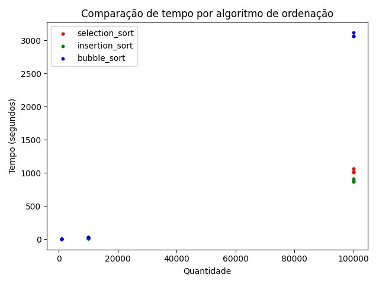
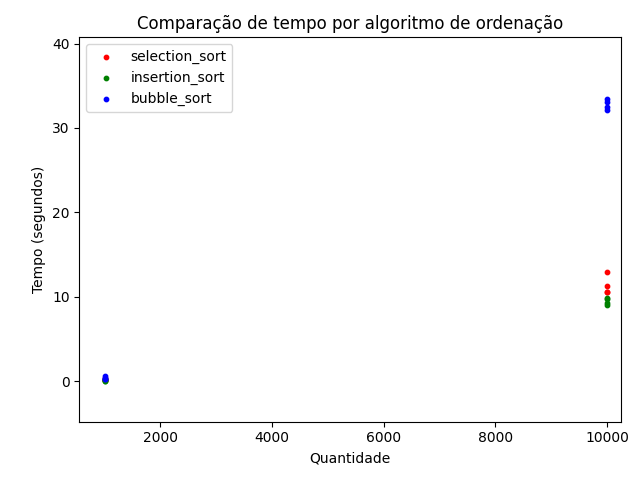
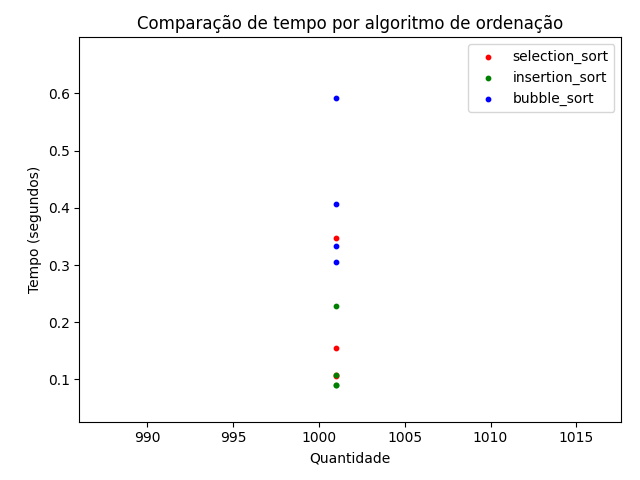
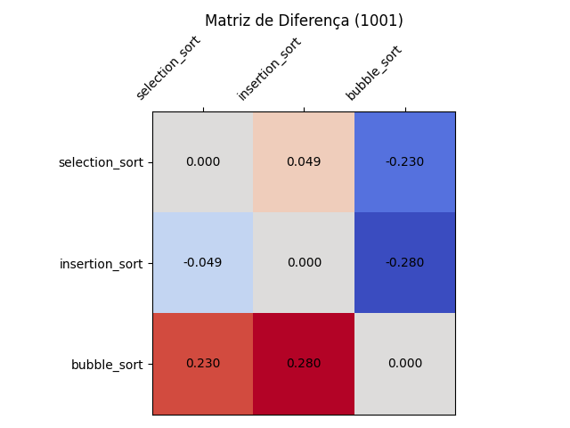
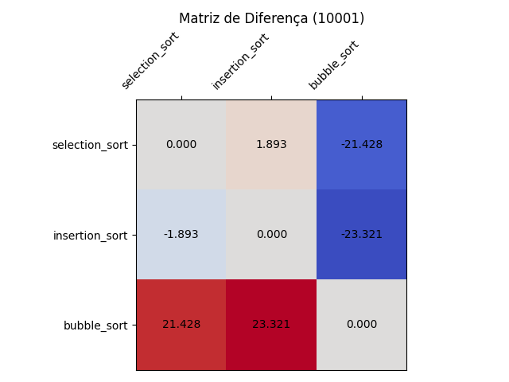
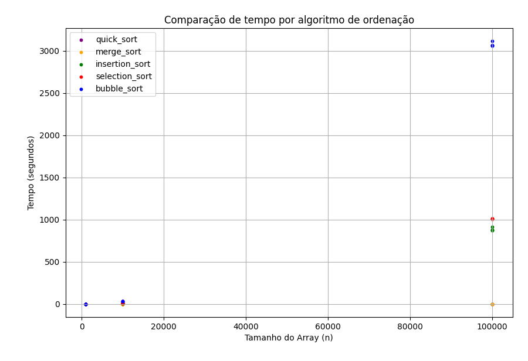
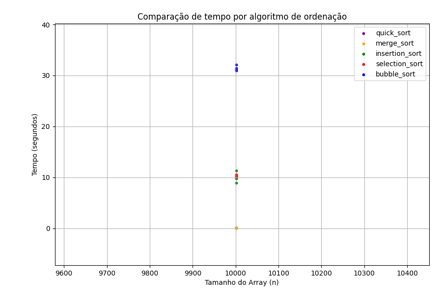
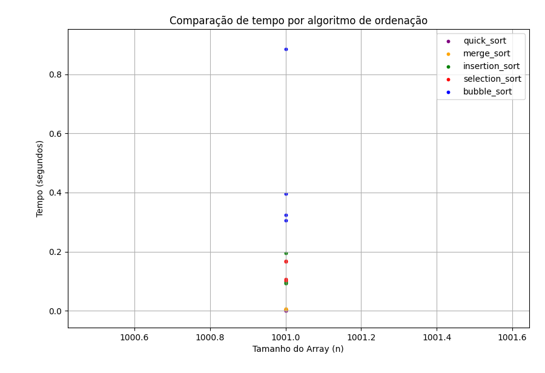
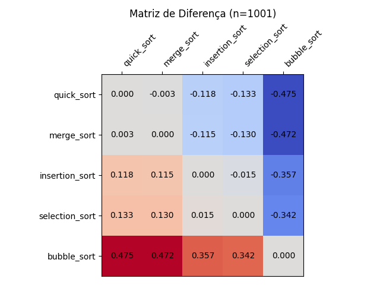
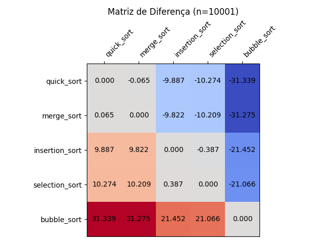

# Unidade 1 - Análise de tempo em algoritmos de ordenação

* [Primeira atividade](#algoritmos-de-ordem-quadrática-on) (Selection Sort, Insertion Sort e Bubble Sort)

* [Segunda atividade](#algoritmos-de-ordem-logarítmica-on-log-n) (Merge Sort e Quick Sort[^1])
[^1]: A complexidade média do Quick Sort é O(n log n), mas pode atingir O(n²) no pior caso.

## Algoritmos de ordem quadrática O(n²)

&nbsp;&nbsp;&nbsp;&nbsp;&nbsp; Primeira etapa da atividade de comparação entre o tempo de execução de algoritmos de ordenação. Algoritmos analisados: **Selection Sort**, **Insertion Sort** e **Bubble Sort**.

&nbsp;&nbsp;&nbsp;&nbsp;&nbsp; Os arrays de entrada possuem várias quantidades de elementos a serem ordenados, sendo eles categorizados da seguinte forma: pequeno, médio e grande.

### Análise gráfica

&nbsp;&nbsp;&nbsp;&nbsp;&nbsp; Após execução controlada em ambiente com características similares, obtivemos os seguintes resultados para estes 3 algoritmos de ordenação.

#### Gráficos de dispersão

&nbsp;&nbsp;&nbsp;&nbsp;&nbsp; Observamos que, como era de se esperar, todos os algoritmos crescem muito rápido (O(n²)). Para vetores de entrada com tamanhos relativamente pequenos, quase não se nota a diferença no tempo de execução dos algoritmos; porém, a diferença explode conforme o tamanho aumenta. Além disso, evidenciando a ineficiência do __bubble sort__ em relação aos outros dois algoritmos.

&nbsp;&nbsp;&nbsp;&nbsp;&nbsp; Quando aproximamos o gráfico, já descartando os resultados de arrays com tamanho não muito grande, podemos ver que há uma diferença, porém insignificante; logo o uso de qualquer algoritmo de ordenação não causaria impacto na ordenação de vetores pequenos.

| __Zoom in__ para entradas não muito grandes | __Zoom in__ para entradas onde o 'n' é muito pequeno |
| :---: | :---: |
|  |  |

#### Matrizes de diferença

&nbsp;&nbsp;&nbsp;&nbsp;&nbsp; Outra forma visual de enxergar o comportamento desses três algoritmos é por meio de matriz de diferença. Onde, par a par, diferenciamos o tempo médio das ordenações dos vetores com diferentes tamanhos de entrada.

&nbsp;&nbsp;&nbsp;&nbsp;&nbsp; Por exemplo, vemos aqui que a diferença entre o tempo médio de execução do __Insertion Sort__ com o __Bubble Sort__ é muito forte e evidente, já comparando com __Selection Sort__ essa diferença quase não se nota.

| Arrays de entrada média | Arrays de entrada grande |
| :---: | :---: |
|  |  |

## Algoritmos de ordem logarítmica O(n log n)

&nbsp;&nbsp;&nbsp;&nbsp;&nbsp; Nesta segunda etapa da atividade de comparação entre o tempo de execução de algoritmos de ordenação. Algoritmos analisados: **Merge Sort** e **Quick Sort**[^1].

&nbsp;&nbsp;&nbsp;&nbsp;&nbsp; Os arrays de entrada possuem a mesma instância da atividade anterior, sendo eles categorizados da seguinte forma: pequeno, médio e grande.

### Análise gráfica

&nbsp;&nbsp;&nbsp;&nbsp;&nbsp; Após execução controlada em ambiente com características similares, obtivemos os seguintes resultados para estes outros 2 algoritmos de ordenação.

#### Gráficos de dispersão

&nbsp;&nbsp;&nbsp;&nbsp;&nbsp; Vemos que os dois novos algoritmos não crescem tão rápido, pois sua complexidade (O(n log n)) impede a explosão de tempo para entradas grandes. Para vetores de entrada com tamanhos relativamente pequenos, quase não se nota a diferença no tempo de execução entre todos os algoritmos (os próximos graficos dão uma visão melhor para instâncias pequenas). Além disso, não evidenciamos vantagem em tempo de execução significativa entre o __Merge Sort__ e __Quick Sort__. A escolha de seu uso parte da análise de suas vantagens e desvantagens em relação a outros aspectos como: manutenção na ordem dos elementos, uso de memória extra, etc.

&nbsp;&nbsp;&nbsp;&nbsp;&nbsp; Quando aproximamos o gráfico, em casos de entrada média, ainda não vemos notória diferença entre o __Merge Sort__ e __Quick Sort__, inclusive os pontos estão sobrepostos. Já com relação aos algoritmos da primeira etapa, embora ainda mostre melhor eficiência, os tempos são muito parecidos, não havendo real vantagem. Na prática, podemos dizer que algoritmos de ordem quadrática são de uso bem específicos ou apenas didático, por terem facilidade de compreensão, já o __Merge Sort__ e __Quick Sort__ são mais voltados para ambientes de produção, já que esperamos alto desempenho e eficiência, embora sejam mais complexos de se entender.

| __Zoom in__ para entradas não muito grandes | __Zoom in__ para entradas onde o 'n' é muito pequeno |
| :---: | :---: |
|  |  |

#### Matrizes de diferença

&nbsp;&nbsp;&nbsp;&nbsp;&nbsp; Quando analisamos a matriz de diferença, essa diferença não é notória para entrada pequena; o tempo pode se tornar irrelevante para alguns cenários.

&nbsp;&nbsp;&nbsp;&nbsp;&nbsp; Embora notemos uma grande discrepância no tempo para grandes entradas, isso confirma o alto desempenho e eficiência entre algoritmos de ordem logarítmica e quadrática. 

| Arrays de entrada média | Arrays de entrada grande |
| :---: | :---: |
|  |  |

# Unidade 2 - Análise de algoritmos gulosos 

* [Primeira atividade](#árvore-de-espalhamento-e-caminho-mínimo) (Kruskal & Prim)

* [Segunda atividade](#problema-da-mochila-inteira) (Problema da mochila)

## Árvore de espalhamento e caminho mínimo

&nbsp;&nbsp;&nbsp;&nbsp;&nbsp; O problema que devemos atentar para as várias abordagens usando algoritmos gulosos é a quantidade de vértices, pois, na tentativa de achar a solução ótima, aumentamos muito o custo de processamento e memória. 

  ### Problema da árvore de espalhamento mínimo
  
  &nbsp;&nbsp;&nbsp;&nbsp;&nbsp; O algoritmo de Kruskal utiliza uma abordagem gulosa para selecionar as arestas de menor peso, garantindo que não haja ciclos durante a construção da árvore. Isso permite encontrar uma solução ótima para o problema da árvore geradora mínima de forma eficiente, sendo bastante utilizado em problemas de redes e otimização.

  ### Problema do caminho mínimo

## Problema da mochila inteira

